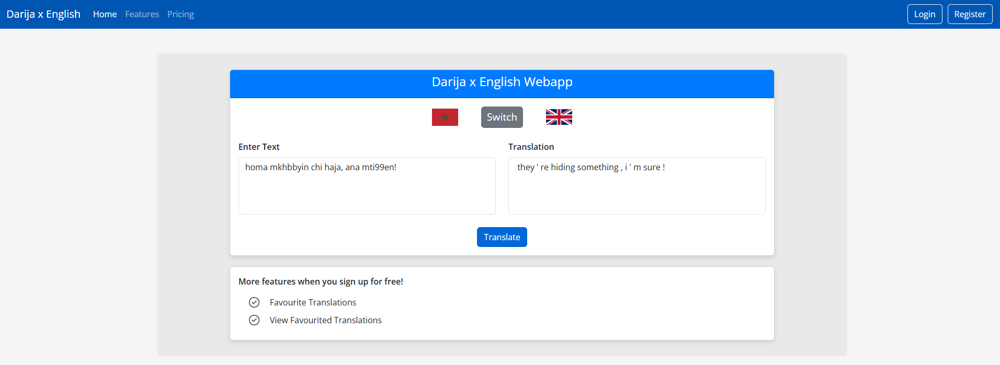

# 🗣️ Darija to English Translator Web App (Final year project at University)

This is a full-stack web application built with **Django**, **Python**, **HTML**, **CSS**, and **JavaScript** that translates Moroccan Darija (a dialect of Arabic) into English.

Registered users can log in to use the translator, view previous translations, and explore an intuitive, minimal interface.

---

## 📸 Preview



---

## ✨ Features

- 🧠 Utilises a Seq2Seq model with a LSTM (Long Short-Term Memory) encoder-decoder architecture.

- 🔐 **User Registration & Login**  
  Create an account and log in securely using Django's built-in authentication system.

- 🌍 **Darija to English Translationa and vice versa**  
  Switch between Morrocan Arabic to English and English to Moroccan Arabic translations using a trained NLP model.

- 📜 **Translation History**  
  Logged-in users can view their previous translations.

- 🎨 **Clean, Responsive Interface**  
  Styled with HTML, CSS, and JavaScript to provide a clean and interactive user experience.

---

## 🚀 Technologies Used

- **Backend:** Django (Python)
- **Frontend:** HTML, CSS, JavaScript
- **Authentication:** Django Auth
- **Database:** SQLite (default) or MySQL (optional)
- **Model:** Pre-trained NLP model (DarijaBERT or similar)

---

## 	📈 Performance

Whilst some sentences are translated with 100% accuracy, it can be said that the translation accuracy of my models could use some improvement. In my dissertation, I came to the conclusion that training data and computational power were the main limiting factors which contributed to the lack of accuracy in the translations. I also found that the use of a transformer model would have significantly increased my chances of accurate translations due to their ability to use self-attention to directly model relationships between any two tokens regardless of their distance in the sequence. This would be especially beneficially in my project since I found accuracy diminished rapidly in longer sentences and towards the end of sentences.

I trained my models on a set of 30.000 sentence pairs in English and Darija which is considered extremely low when comparing to other projects. For example Wu et al. (2016) demonstrated that the use of large datasets, such as 4.5 million sentence pairs resulted in 'state-of-the-art' performance when training neural machine translation systems. They claimed that when using smaller datasets (less than 100,000 sentence pairs), models tend to become prone to overfitting and less accurate.

**Source: Wu et al., 2016, “Google’s Neural Machine Translation System: Bridging the Gap between Human and Machine Translation**


## 🛠️ Getting Started

### 🔧 Prerequisites

- Python 3.8+
- `pip` or `venv`
- MySQL
- Git

### 📦 Installation

1. **Clone the repository:**

```bash
git clone https://github.com/your-username/darija-translator.git

```
2. pip install mysqlclient
3. pip install torch
4. pip install transformers
5. pip install nltk
6. pip install pydoda
7. download the mysql image on docker and run as a container on port 3308
8. Add a new connection on mysql workbench on local host port 3308
9. cd darija
10. python manage.py runserver
